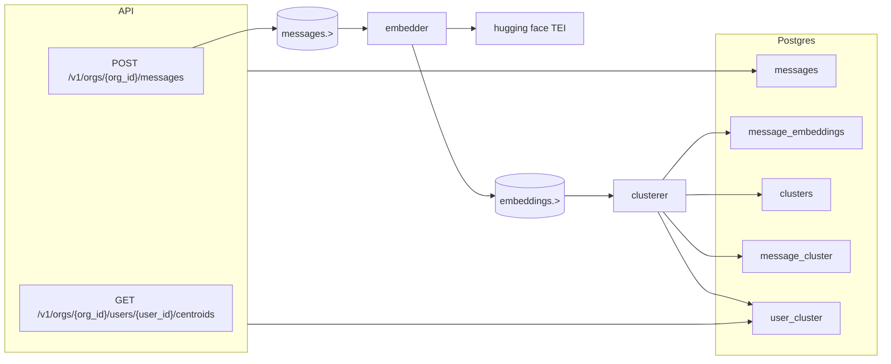

# Cross talk network builder

The network builder service is a semantic text processor that receives user messages
and supports a query that will list other users that are 'close' in terms of semantic connection (i.e. are talking about or writing about the same thing).

Details of the mathematics used can be found in [maths.md](maths.md).


## Local deployment

```bash
docker compose down && docker compose up --build
. .venv/bin/activate
pytest
```

Services started:
- `api` message injestion and query endpoints
- `embedder` consumes `messages.>` and publishes `embeddings.>`
- `clusterer` consumes `embeddings.>` and publishes `clusters.>`
- `tei` hosts `BAAI/bge-base-en-v1.5` for embedding inference

- API: http://localhost:8000
- NATS: nats://localhost:4222
- NATS monitor: http://localhost:8222
- Postgres: localhost:5432
- TEI: http://localhost:8080

## Tests

- Unit tests (no Docker/NATS/Postgres required): `pytest tests/unit`
- Integration tests (requires `docker compose up`): `pytest tests/integration`
- Or marker-based selection:
  - `pytest -m unit`
  - `pytest -m integration`
- Or just `pytest` to run everything.

## Logical organization



## Embeddings provider

The default embedder provider is TEI with `BAAI/bge-base-en-v1.5`.

Key environment variables (configured in `docker-compose.yml`):
- `EMBED_PROVIDER=tei` (`stub` best for development to save hanging about)
- `EMBED_MODEL_VERSION=BAAI/bge-base-en-v1.5@tei`
- `TEI_URL=http://tei:80`
- `EMBED_DIM=768`
- `EMBED_FALLBACK_TO_STUB=true` (fallback when TEI is unavailable)

Implementation modules:
- `app/embed/tei_embedder_consumer.py`
- `app/embed/stub_embedder_consumer.py`
- `app/embed/embedder_consumer.py` (provider dispatcher)
